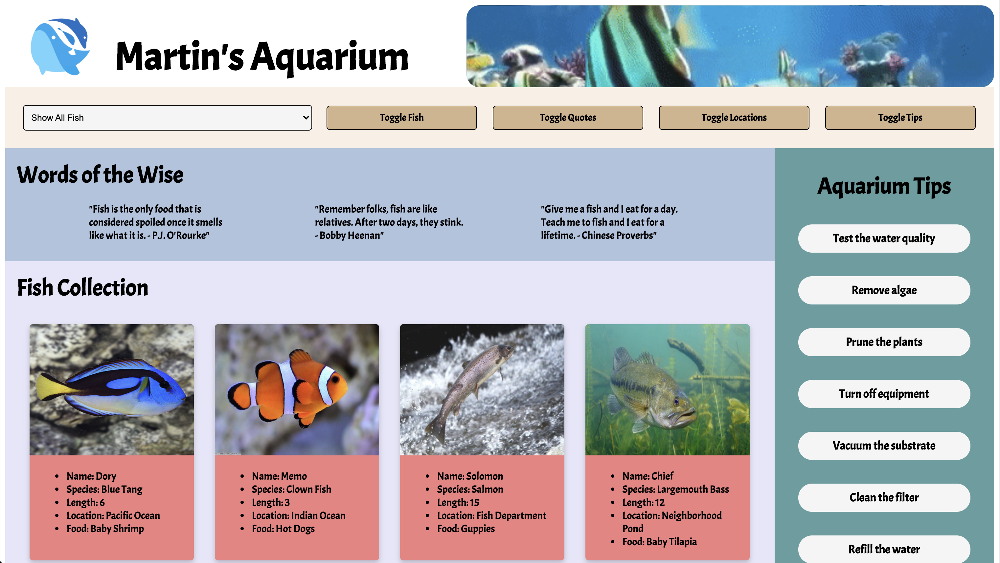

# Martin's Aquarium

Landing site for fictional aquarium owner showcasing fish collection, harvesting locations, aquarium tips and fish quotes.

## Technologies Used

- HTML
- CSS
- JavaScript

## Usage

1. Initiate 'database.json' file in API directory with JSON-Server.
2. Open 'index.html' file in browser.

### Filter Fish by Length

In dropdown option select:

- Holy Fish: fish w/ lengths of multiples of 3
- Soldier Fish: fish w/ lengths of multiples of 5
- Basic Fish: fish w/ lengths not multiples of 3 or 5

To display fish in collection with specific lengths.

### Hide Components

Click on either Toggle Fish, Toggle Quotes, Toggle Locations, or Toggle Tips to hide those components from view.

## Concepts Learned

- Semantic HTML
- CSS BEM Methodology
- CSS Flexbox and Effects
- DOM Manipulation w/ JavaScript
- Creating REST API w/ JSON-Server and retrieving data
- JavaScript functional programming
- Dynamically creating HTML components w/ JavaScript
